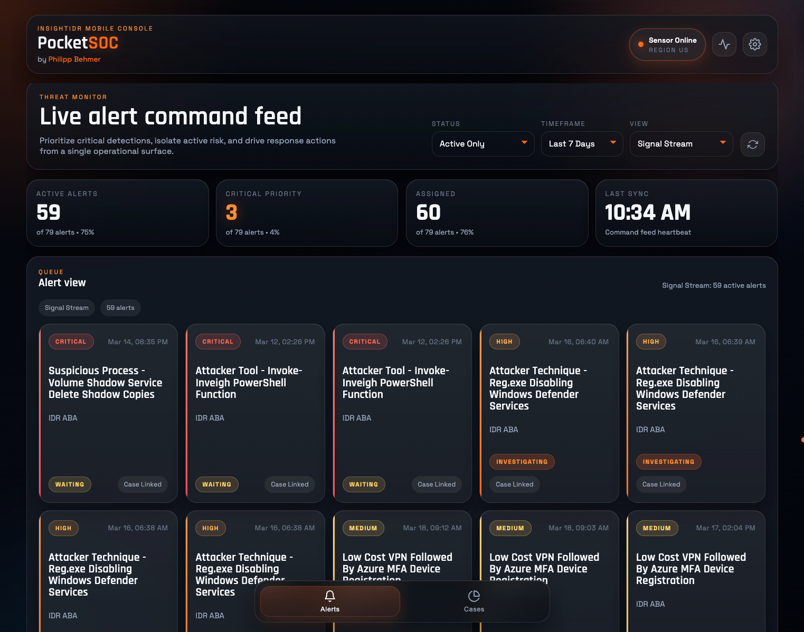
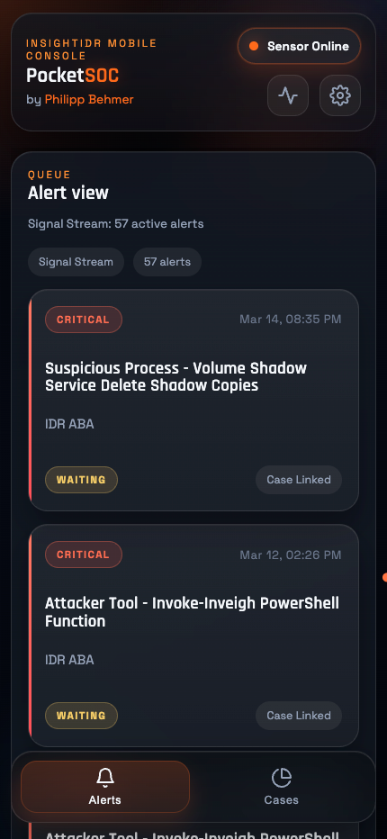
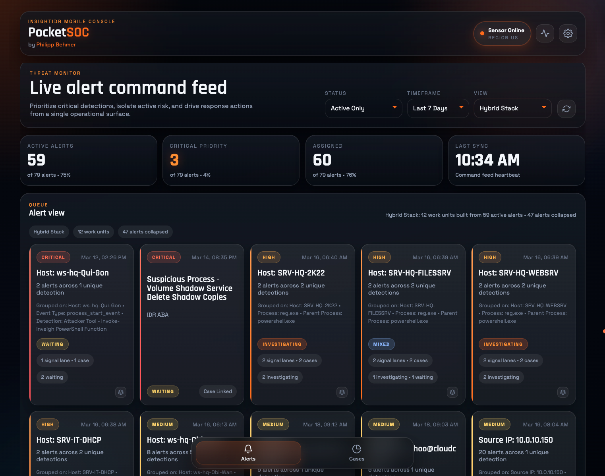
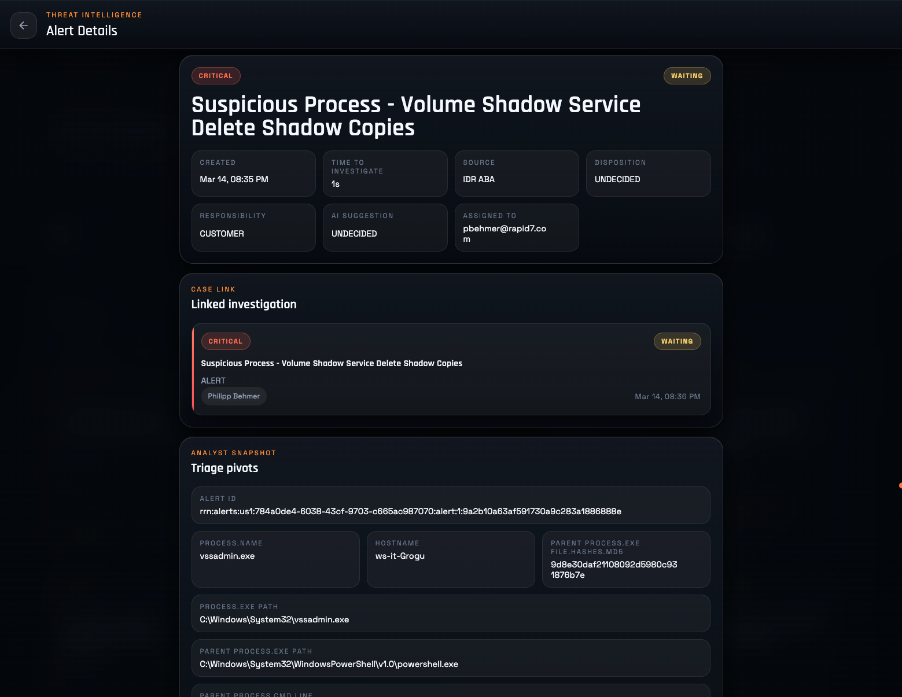
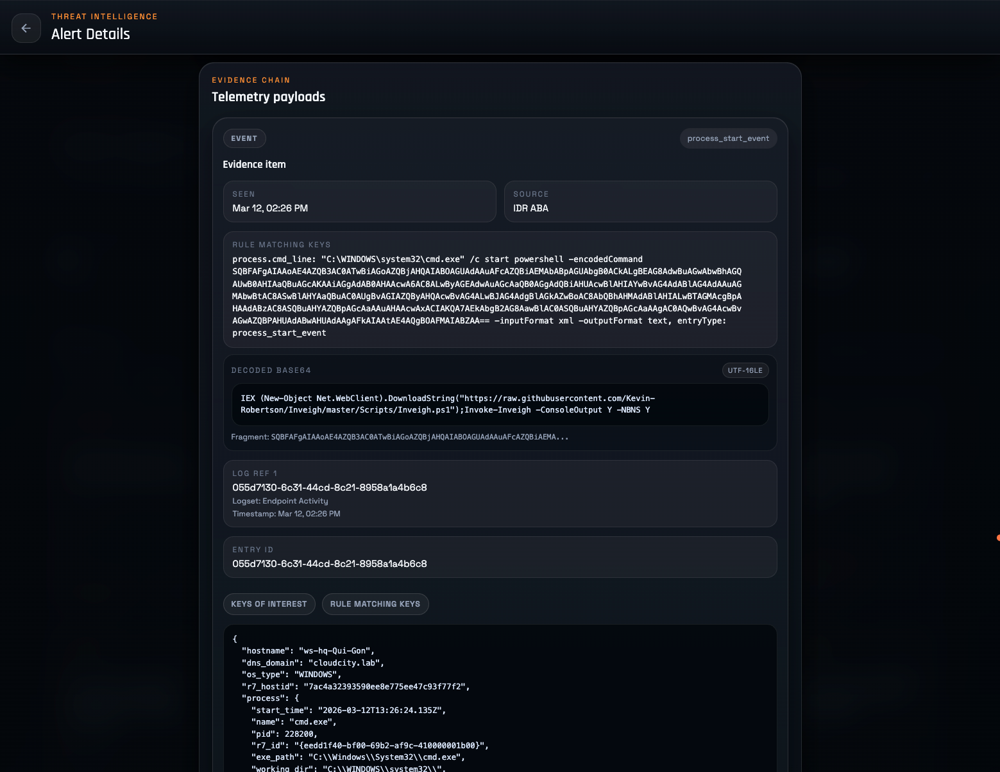
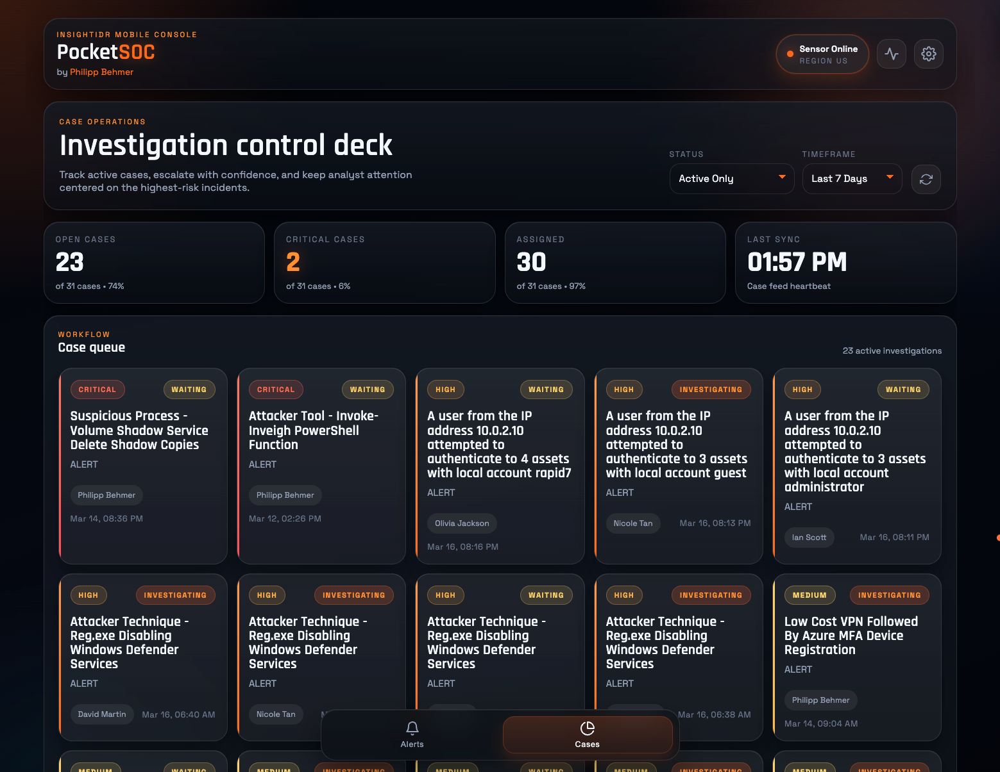
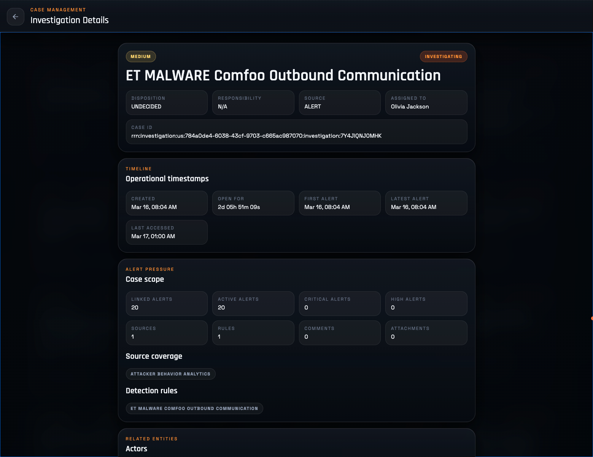
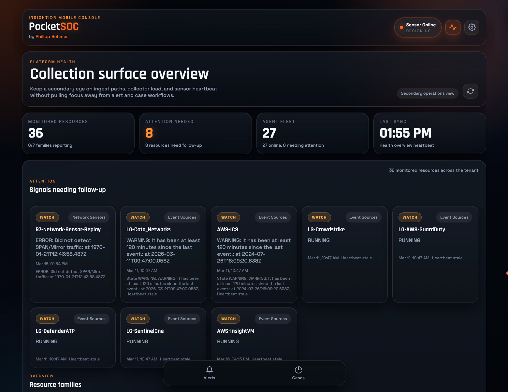

# PocketSOC

PocketSOC delivers a fast, mobile-friendly way to access Rapid7 InsightIDR, helping SOC analysts triage alerts and investigate incidents from anywhere.

<p><strong><span style="color: red;">Disclaimer: PocketSOC is a community project and is not officially supported, endorsed, or maintained by Rapid7.</span></strong></p>

## Highlights

- Per-browser remembered sessions with encrypted stored config.
- Alert queue, investigation queue, and health overview in one UI.
- Alert detail enrichment for evidences, actors, process trees, rule summaries, MITRE, logsets, and event sources.
- Investigation detail workflows for status/priority/disposition changes, reassignment, comments, and attachments.
- Docker image and GitHub Actions workflow for CI plus optional Docker Hub publishing.

## Quick Start Using Docker

Clone the repository or download [docker-compose.yml](https://raw.githubusercontent.com/PhilippBehmer/rapid7-insightidr-mobile-console/refs/heads/main/docker-compose.yml).

```bash
git clone https://github.com/PhilippBehmer/rapid7-insightidr-mobile-console.git
cd rapid7-insightidr-mobile-console
```

Start Docker Compose
```
docker compose up -d
```

Or run the published container manually:

```bash
docker volume create pocketsoc-data
docker run --rm -p 3000:3000 \
  -e POCKETSOC_CONFIG_FILE=/app/data/config.json \
  -v pocketsoc-data:/app/data \
  philippbehmer/rapid7-insightidr-mobile-console:latest
```

Then open `http://localhost:3000` and enter:

- an Insight Platform API key
- a supported region: `us`, `eu`, `ca`, or `ap`

## Configuration

Copy configuration template:

```bash
cp .env.example .env
```

Environment variables:

| Variable | Purpose | Default / Notes |
| --- | --- | --- |
| `POCKETSOC_IMAGE` | Docker Compose image override. | `philippbehmer/rapid7-insightidr-mobile-console:latest` |
| `POCKETSOC_HOST_PORT` | Host port published by `docker-compose.yml`. | `3000` |
| `POCKETSOC_CONFIG_FILE` | Path to persisted session state. | Docker examples use `/app/data/config.json`; outside Docker the app default is `backend/local/config.json`. |
| `POCKETSOC_SESSION_SECRET_FILE` | Overrides the auto-generated secret-file path when `POCKETSOC_SESSION_SECRET` is not provided. | Defaults to `session-secret.hex` next to `POCKETSOC_CONFIG_FILE`. |
| `POCKETSOC_SESSION_SECRET` | Stable secret used to encrypt remembered browser configs. | Optional. |
| `POCKETSOC_ATTACHMENT_MAX_BYTES` | Upload cap for proxied attachment uploads. | `50000000` (50 MB) |
| `POCKETSOC_FORCE_SECURE_COOKIE` | Forces the session cookie to include `Secure`. | Optional `true` / `false`; useful behind TLS-terminating proxies that do not forward HTTPS information cleanly. |

## Screenshots

### Alerts Desktop

<p align="center">
  
</p>

### Alerts Mobile

<p align="center">
  
</p>

### Alert Stacking

<p align="center">
  
</p>

### Alert Details and Triage Pivots

<p align="center">
  
</p>

### Automatic Base64 Decoding

<p align="center">
  
</p>

### Investigation Overview

<p align="center">
  
</p>

### Investigation Details

<p align="center">
  
</p>

### Health Overview

<p align="center">
  
</p>

## Manual Installation

Install dependencies:

```bash
cd backend && npm install
cd ../frontend && npm install
```

Run the backend and frontend together from the repo root:

```bash
npm run dev
```

Open the frontend at `http://localhost:5173`.

## Manual Docker Build


If you want to build and run the image from your checked-out source instead, that remains a separate local workflow:

```bash
docker build -t pocketsoc:local .
docker run --rm -p 3000:3000 \
  -e POCKETSOC_CONFIG_FILE=/app/data/config.json \
  -v pocketsoc-data:/app/data \
  pocketsoc:local
```

## Testing

Current automated checks:

```bash
cd backend && npm test
cd frontend && npm test
```

- Backend tests cover session/config behavior, selected route contracts, and attachment streaming paths.
- Frontend `npm test` is currently a production build smoke check, not a browser interaction suite.

## Architecture

- `backend/` is an Express proxy and normalization layer for Rapid7 InsightIDR APIs.
- `frontend/` is a framework-free Vite app tuned for phone-sized alert review and case response.
- In production, the backend serves the built frontend from `frontend/dist` on the same origin as `/api`.
- The production container serves both layers from the same origin on port `3000`.
- The app remembers config per browser for 90 days by storing an encrypted server-side session blob and a secure `HttpOnly` session cookie.

## Repository Layout

- `backend/server.js`: backend routes, Rapid7 proxy logic, session/config persistence, response shaping, caches
- `backend/server.test.js`: backend smoke and regression tests
- `frontend/main.js`: app state, fetch orchestration, navigation, overlay logic
- `frontend/components.js`: rendering helpers and the main frontend XSS boundary
- `frontend/style.css`: UI system and layout
- `Dockerfile`: multi-stage production build
- `docker-compose.yml`: local container runtime example
- `AGENTS.md`: repository-specific working notes for future coding sessions
